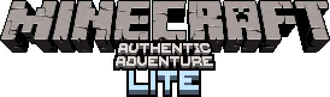

 

    

Minecraft Authentic Adventure Lite is a minimalistic mod for Minecraft 1.3.2 to 1.8.9 that tweaks primary aspects to be more Beta-esque. It is a smaller version of the [Authentic Adventure](https://github.com/BlueStaggo/AuthenticAdventure) mod which features many more customisation options and gameplay tweaks.

## Installation
Authentic Adventure Lite makes use of the [Ornithe project](https://ornithemc.net/) to allow for easy porting between versions as well as compatibility with other mods. Simply install Ornithe then download the respective version of the mod from [the releases page](https://github.com/BlueStaggo/authadvlite) and move it to your mods folder. Ornithe standard libraries are not required.

## Features
- Overhauled world generation, making it more hilly and Beta-esque (mostly identical to the original mod)
- Reworked hunger system (hunger only decreases with sprinting, starvation has been removed and food directly heals health)
- Restored old passive mob spawning
- Enchantments cost one quarter of the level requirement 
- Ability to safely upgrade to later Minecraft versions

## Extra Features (Full Mod)
*These features can be found in the full version of the mod for 1.2.5*
- Plenty of customisation options for world generation, gameplay and visuals to fine tune your experience
- New classic mode for a truly beta-like experience
- Extra challenging hardcore mode
- Plenty of minor gameplay and visual tweaks
